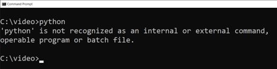
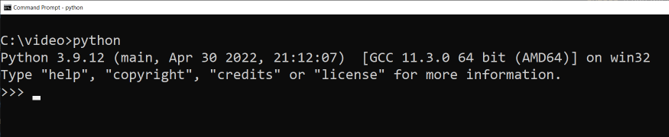

## Install Python

Before installing python, make sure that it isn't already installed. Depending on your configuration, python may be installed using one of three aliases.

1. Alias python. Type  ```python``` on the command line. If you get an error you do not have python installed with the python alias. Go to alias 2. Note, some windows machines will bring up the Windows Marketplace app if you type ```python```. Close the marketplace window and try alias 2.
2. Alias py. Type ```py``` on the command line. If you get an error you do not have python installed with the py alias. Go to alias 3. Note, some windows machines will bring up the Windows Marketplace app if you type ```py```. Close the marketplace window and try alias 3.
3. Alias python3. Type  ```python3``` on the command line. If you get an error you do not have python installed with the python3 alias. You need to install python. Note, some windows machines will bring up the Windows Marketplace app if you type ```python3```. Close the marketplace window and install python.

For example, on Windows, if python is not installed, you would see the following on the terminal:



If python is installed, you would see the following on the terminal:



(Quick tip: to get out of the python interactive console, type ```exit()```)

To install python, go to https://www.python.org/downloads/ and get the installer that matches your system. After it is installed, you should see the above result when you type ```python```.
